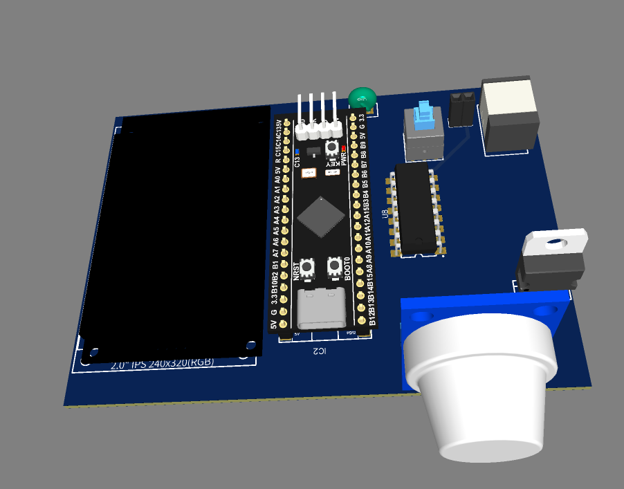

<h1>STM32F4 Control-air-quality-using-AI</h1>

Device is created for controlling air quality and contains:

<ul>
  <li>Fan</li>
  <li>Gas sensor for detecting CH4 (Methane), but can accommodate MQ135 or other types of modules</li>
  <li>Temperature sensor for monitoring temperature conditions</li>
  <li>Displaying information using a 2-inch TFT display with ST7789 driver</li>
</ul>

For more information about the PCB fabrication process, refer to the <a href="PCB fabric.docx">PCB fabrication document</a>.

